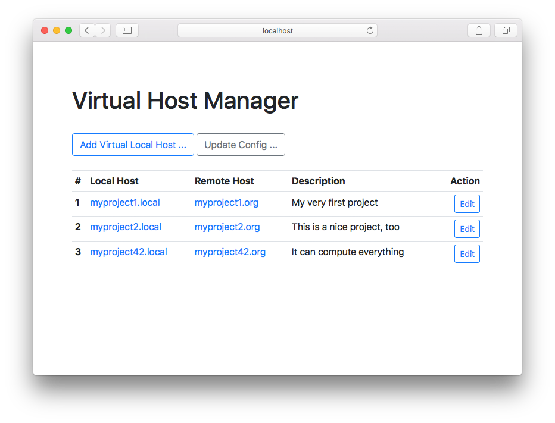
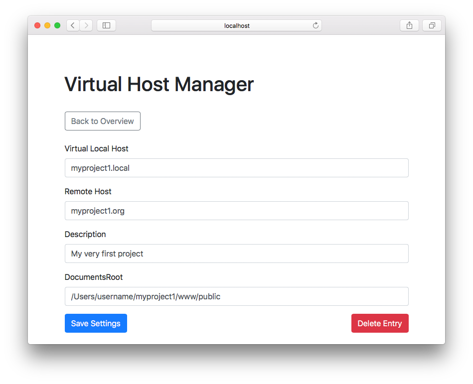

# A Virtual Host Manager (for MAMP)





## About

With VirtualHostManager you can easily manage and setup your domains and virtual hosts for local development or testing. If you wish more features feel free to contribute.



## Installation

Clone the repository to your computer. Install composer (Dependency Manager for PHP) if you already didn't.

If composer is installed globally, run ...

```bash
cd VirtualHostManager
composer install
```

Next Setup MAMP. The root-directory of the Apache Web-Server have to point to the VirtualHostManangers root.

To use multiple vhosts, you have to uncomment the following line
*/Applications/MAMP/conf/apache/httpd.conf*

```apacheconf
Include /Applications/MAMP/conf/apache/extra/httpd-vhosts.conf
```

Now you have to add this entry in
*/Applications/MAMP/conf/apache/extra/httpd-vhosts.conf*

```apacheconf
<VirtualHost *:80>
    ServerAdmin webmaster@virtualhostmanager.local
    DocumentRoot "path_to_VirtualHostMananger"
    ServerName localhost
    ErrorLog "logs/localhost.com-error_log"
    CustomLog "logs/localhost.com-access_log" common
    <Directory />
        AllowOverride All
    </Directory>
</VirtualHost>
```

Now you are ready. You can try it. Open localhost in your browser.

### Notice
If you are using macOS 10.15 you have to execute:
```
sudo /Applications/MAMP/bin/stopApache.sh
sudo /Applications/MAMP/bin/startApache.sh
```

## Contributing
If you wish more features feel free to contribute. In order to contribute, you just have to fork this repository.

## License
MIT License. See  LICENSE.md
